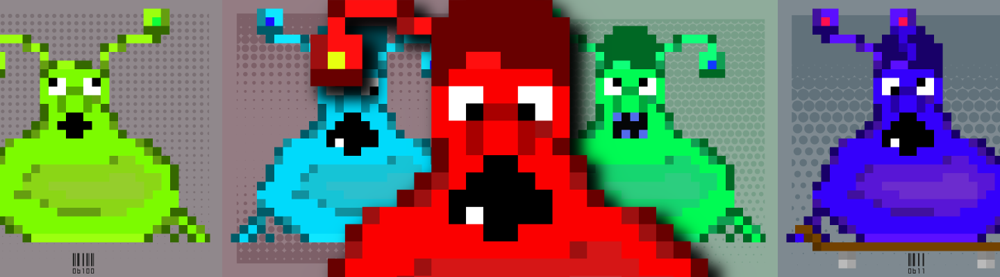
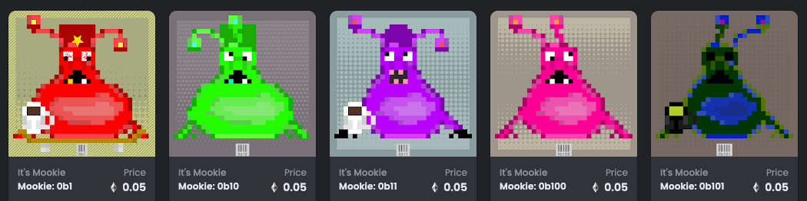

# It's Mookie
It's Mookie. Mookie isn't pretty. It's Mookie baby. Now go.

## Description
For this collection I wanted to dive into the world of PFPs and create an entity with a projected personality. That entity is Mookie and that personality is yours. Now go. There is a 12,000 total supply. These will mint as the first lots sell to fund the next batches. The more you buy the more Mookie can breed ... help Mookie breed.

[Etherscan](https://etherscan.com/address/0x9c285E47c61B625952EF1F492160CefE12D69ffc) | 
[Opensea](https://opensea.io/collection/its-mookie) | 
[Rarible](https://rarible.com/itsmookie/items) | 
[Twitter](https://twitter.com/mindrash) | 
[metadevil.io](https://metadevil.io) | 
[pebkac.fyi](https://pebkac.fyi)

## Examples

## Frequently Asked Questions
- <strong>What kind of animal is Mookie?</strong> Mookie is not an animal
- <strong>How does Mookie drink coffee without hands?</strong> His mouth
- <strong>What kind of variations are there?</strong> See the Variations section
- <strong>Are any two Mookies alike?</strong> Mathmaticaly very doubtful, but that would be cool if there were twins out there
- <strong>Can Mookie be staked?</strong> I'm thinking about that capability and what it would provide
- <strong>Does Mookie wear shoes?</strong> Sometimes - maybe 10% of the time
- <strong>What is the total supply? 12,000

## Technologies
- Python - art generation
- Solidity - ERC-721
- Ethereum - the gaaaaas!
- IPFS - hashed image on meta

Contract: 0x9c285E47c61B625952EF1F492160CefE12D69ffc

## Variations

| variation           | description                                             |
|---------------------|---------------------------------------------------------|
| background_color    | tuple(random.choices(range(200, 256), k=3)) |
| background_layover  | 9 options |
| antenna             | 3 options x 2 |
| head                | 3 options |
| eyes                | random 90 degree rotate x 2 |
| mouth               | 4 options 1 impacted by hue |
| body                | 2 |
| hue                 | random -.5 to .5 on original |
| shoes               | 20% probability |
| coffee              | 10% probability |
| skateboard          | 10% probability with random 90 degree rotate wheels x 2 |
| freak_elipse        | 5% probability with randomized pallette |

---

[Etherscan](https://etherscan.com/address/0x9c285E47c61B625952EF1F492160CefE12D69ffc) | 
[Opensea](https://opensea.io/collection/its-mookie) | 
[Rarible](https://rarible.com/itsmookie/items) | 
[Twitter](https://twitter.com/mindrash) | 
[metadevil.io](https://metadevil.io) | 
[pebkac.fyi](https://pebkac.fyi)
