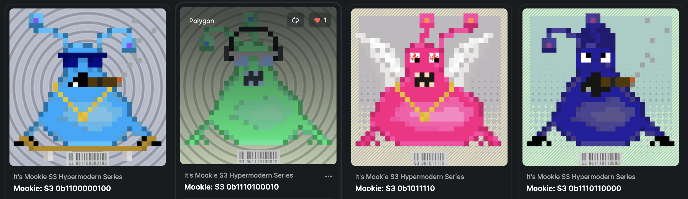
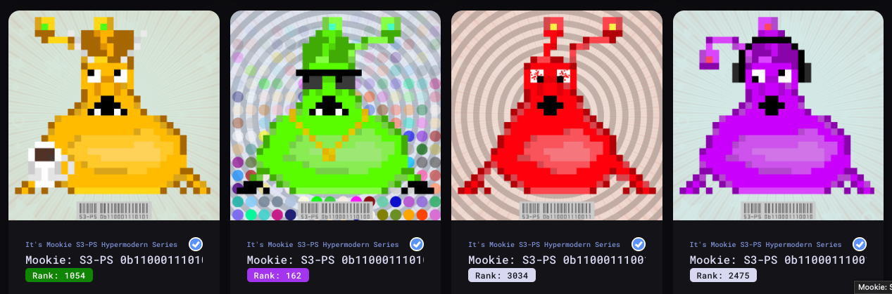

# It's Mookie Original, S3, and S3-PS Hypermodern Series
It's Mookie. Mookie isn't pretty. It's Mookie baby. Now go. 
<strong>(On Ethereum)</strong> 
[Opensea](https://opensea.io/collection/its-mookie) | 
[Rarible](https://rarible.com/itsmookie/items)

Introducing It's Mookie <strong>S3 Hypermodern Series</strong>! Now with cigars, boobs, wings, and more! Are you hypermodern???
<strong>(On Polygon)</strong> 
[Opensea](https://opensea.io/collection/its-mookie-s3) | 
[Rarible](https://rarible.com/itsmookie-s3/)

Also introducing It's Mookie <strong>S3-PS Hypermodern Series</strong>! Now with cigars, boobs, wings, and more! New background set!
<strong>(On Fantom)</strong> 
[Paintswap](https://paintswap.finance/marketplace/collections/0x16d2e7daf6636c49dd5dd85a09320d7b457f89c5)

## Description
For this collection I wanted to dive into the world of PFPs and create an entity with a projected personality. That entity is Mookie and that personality is yours. Now go. There is a 12,000 total supply on the original (free mint - go for it) and 3,333 each on S3 and S3-PS. These will mint as the first lots sell to fund the next batches. The more you buy the more Mookie can breed ... help Mookie breed.

[Etherscan](https://etherscan.com/address/0x9c285E47c61B625952EF1F492160CefE12D69ffc) | 
[Polyscan](https://polygonscan.com/address/0x501637fa5ea4c19086425de328f45309a973d669) | 
[Fantomscan](https://ftmscan.com/address/0x16d2e7daf6636c49dd5dd85a09320d7b457f89c5) | 
[Twitter](https://twitter.com/mindrash) | 
[Discord](https://discord.gg/B8F2R3qd) | 
[metadevil.io](https://metadevil.io) | 
[pebkac.fyi](https://pebkac.fyi)

## Examples
### Original flavor

### S3 Hypermodern Series flavor

### S3-PS Hypermodern Series flavor

## Frequently Asked Questions
- <strong>What kind of animal is Mookie?</strong> Mookie is not an animal
- <strong>How does Mookie drink coffee without hands?</strong> His mouth
- <strong>What kind of variations are there?</strong> See the Variations section
- <strong>Are any two Mookies alike?</strong> Mathmaticaly very doubtful, but that would be cool if there were twins out there
- <strong>Can Mookie be staked?</strong> I'm thinking about that capability and what it would provide
- <strong>Does Mookie wear shoes?</strong> Sometimes - maybe 10% of the time
- <strong>What is the total supply? 12,000 original, 3,333 S3, and 3,333 S3-PS 

## Technologies
- Python - art generation
- Solidity - ERC-721
- Ethereum - the gaaaaas! and ... S3 is on Polygon because much less gas. S3-PS now on Fantom too!
- IPFS - hashed image on meta

It's Mookie - Contract: 0x9c285E47c61B625952EF1F492160CefE12D69ffc 
It's Mookie S3 Hypermodern Series - Contract: 0x501637fa5Ea4c19086425De328F45309a973D669 
It's Mookie S3-PS Hypermodern Series - Contract: 0x16d2e7daf6636c49dd5dd85a09320d7b457f89c5 

## Variations

### Original (12,000) on Ethereum

| variation           | description                                             |
|---------------------|---------------------------------------------------------|
| background_color    | tuple(random.choices(range(200, 256), k=3)) |
| background_layover  | 9 options |
| antenna             | 3 options x 2 |
| head                | 3 options |
| eyes                | random 90 degree rotate x 2 |
| mouth               | 4 options 1 impacted by hue |
| body                | 2 |
| hue                 | random -.5 to .5 on original |
| shoes               | 20% probability |
| coffee              | 10% probability |
| skateboard          | 10% probability with random 90 degree rotate wheels x 2 |
| freak_elipse        | 5% probability with randomized pallette |

---

### S3 Hypermodern (3,333) on Polygon

| variation           | description                                             |
|---------------------|---------------------------------------------------------|
| background_color    | tuple(random.choices(range(200, 256), k=3)) |
| background_layover  | 5 options |
| antenna             | 3 options x 2 |
| head                | 3 options |
| eyes                | random 90 degree rotate x 2 |
| mouth               | 4 options 1 impacted by hue |
| body                | 2 |
| hue                 | random -.5 to .5 on original |
| shoes               | 20% probability |
| coffee              | 10% probability |
| skateboard          | 10% probability with random 90 degree rotate wheels x 2 |
| freak_elipse        | 10% probability |
| cigar               | 10% probability |
| boobs               | 10% probability |
| wings               | 10% probability |
| drink               | 10% probability |
| headphones          | 10% probability |
| burger              | 10% probability |
| horns               | 10% probability |
| shades              | 10% probability |

---

### S3-PS Hypermodern (3,333) on Fantom

| variation           | description                                             |
|---------------------|---------------------------------------------------------|
| background_color    | tuple(random.choices(range(200, 256), k=3)) |
| background_layover  | 5 options |
| antenna             | 3 options x 2 |
| head                | 3 options |
| eyes                | random 90 degree rotate x 2 |
| mouth               | 4 options 1 impacted by hue |
| body                | 2 |
| hue                 | random -.5 to .5 on original |
| shoes               | 20% probability |
| coffee              | 10% probability |
| skateboard          | 10% probability with random 90 degree rotate wheels x 2 |
| freak_elipse        | 10% probability |
| cigar               | 10% probability |
| boobs               | 10% probability |
| wings               | 10% probability |
| drink               | 10% probability |
| headphones          | 10% probability |
| burger              | 10% probability |
| horns               | 10% probability |
| shades              | 10% probability |

Seriously, if you have read this far then I love you. Reach out to me on Twitter or Discord (copy this sentence while it is still published in the README) and I will send you a Mookie! 

---

[Etherscan](https://etherscan.com/address/0x9c285E47c61B625952EF1F492160CefE12D69ffc) | 
[Polyscan](https://polygonscan.com/address/0x501637fa5ea4c19086425de328f45309a973d669) | 
[Fantomscan](https://ftmscan.com/address/0x16d2e7daf6636c49dd5dd85a09320d7b457f89c5) | 
[Twitter](https://twitter.com/mindrash) | 
[Discord](https://discord.gg/B8F2R3qd) | 
[metadevil.io](https://metadevil.io) | 
[pebkac.fyi](https://pebkac.fyi)

